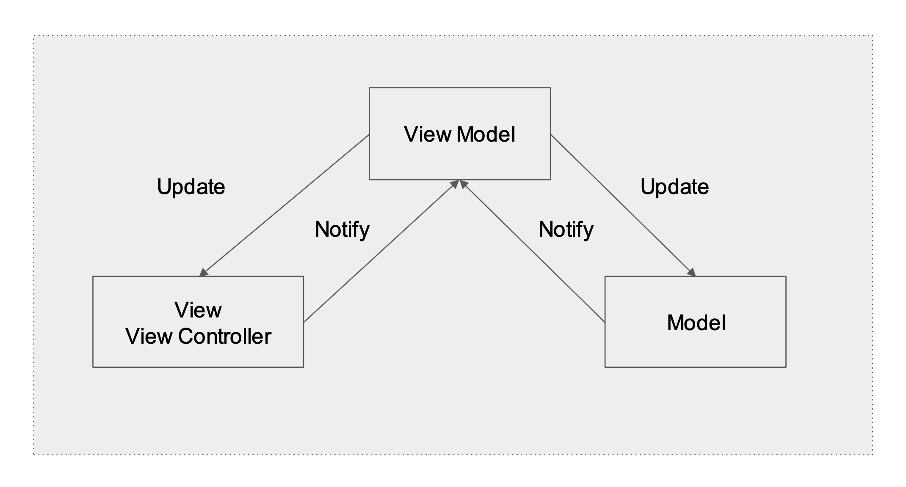
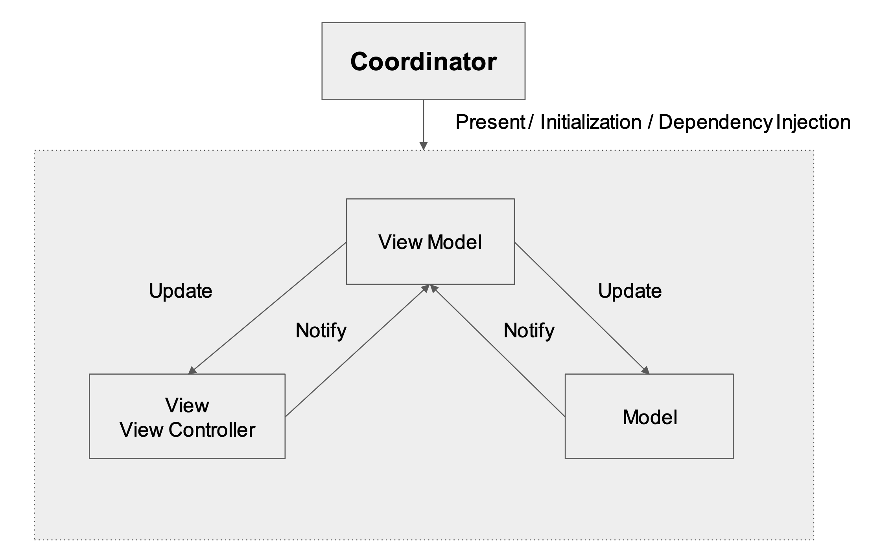
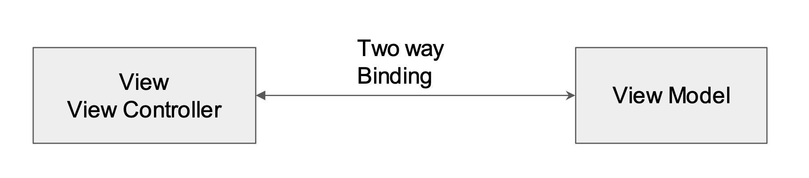

# Engine

 


### Extended MVVM architecture framework in Swift


## What's Engine 

In present days when we start building any kind of data driven or large scale application, the first thing we do is choose a decent architecture for development. Some commonly used architecture patterns are MVC, MVP, MVI, MVVM and VIPER. Among those considering the ease of development and usabilty alongside with testabilty MVVM should be the first choice. But when working with MVVM many of us faced difficulties with maintaing consistency. As a solution `Engine` is here to make your development with MVVM more consistent, effecient and time saving.


#### `E -> Entity -> Model`
#### `N -> Navigation -> Coordinator`
#### `G -> Graphics -> View`
#### `I -> Interactor -> ViewModel`
#### `N -> Narrator -> Dependency`
#### `E -> Events -> States & Actions`


## Theory Of Engine

 
 
In classic MVVM  we have Model, View & ViewModel. Now ViewModel is the place where we write all our UI indipendent logic based codes. But for a massive or complex feature a single ViewModel can get very messed up with different kinds of logic & dependency in one place. Also in classic MVVM the applications navigation flow is not managed.



As a solution first we are introducing the Coordinator for all our navigation and presentation releated tasks.


For offloading the ViewModel we are adding a Dependency element where we will put all our services (API/Storage etc) and outside dependent logics.

We are also adding some events property for generalizing our interaction and user experience flow.



Finally for the communication between different elements (Ex. View -> ViewModel / ViewModel -> View) , we are using the Reactive approach with data binding.


## Engine Components

### Model
Engine has a very powerful `Model` protocol which has many useful built in functionalities. It is recomended to conform to the `Model` protocol when you are declaring any type of custom model.

```swift

protocol RootModelProtocol: Model {
    var title:String { get set}
    var action:String { get set }
}

struct RootModel: RootModelProtocol{
    var title:String
    var action:String
}

```

### Coordinator
For each feature or module a `Coordinator` is mandatory as it centralize the initialization and dependency management of specific module. `Engine` has a `Coordinator` protocol which provide support for navigation flow and presentation. While initializing a coordinator it is required to setup following components 

#### `Base` -> Store the core object for a specific module 
#### `Navigator` -> Manage navigation & presentation 

```swift

protocol RootCoordinatorProtocol: Coordinator{ }

class RootCoordinator: Coordinator, RootCoordinatorProtocol{
    
    init(window:UIWindow?) {
        
        let dependency = RootDependency()
        let viewModel = RootViewModel(coordinator: self, dependency: dependency)
        let controller = RootController.instantiate(viewModel)
        controller.title = "Root"
        
        base = .navigationController(BaseNavigationController(rootViewController: controller))
        navigator = .root(to: base?.navigationController, from: window, animation: true)
    }
}


```

### Events 
For a Data driven application module, its common that data can be in different states (Empty,Populated) and when user interect with those data they can take various actions (search,add,update,delete). So in `Engine` for every module it is recomended to declare the specific `State`s & `Action`s as enum before dig in deeper. 

```swift

enum RootState{
    case normal,empty,populated,loading,error
}

enum  RootAction{
    case next,search
}

```

### View & ViewController

In `Engine` most of the UI components from UIKit are wrapped with custom types. So it is recommended to use this `Engine` specific types while declaring a View or ViewController. Also this custom classes are comes with some predefine functions for organising view configuration releated codes.


```swift

protocol RootControllerProtocol: ViewController<RootViewModelProtocol> { }

class RootController: ViewController<RootViewModelProtocol>, RootControllerProtocol {
    
    override func setupController() {
        super.setupController()
    }
    
    override func setupViewModel() {
        super.setupViewModel()
    }
   
    override func setupReactive() {
        super.setupReactive()
    }
    
    override func setupView() {
        super.setupView()
    }
    
    override func setupLayout() {
        super.setupLayout()
    }
}

```

### Dependency 

When we modularize a specific feature in any applications, there is always some outside dependency we have to manage. `Engine` has  `Dependency` component for putting all those stuff in one place.

```swift

protocol RootDependencyProtocol{
    var api:ApiService { get set }
    var storage:StorageService { get set }
}

struct RootDependency: RootDependencyProtocol {
   var api:ApiService
   var storage:StorageService 
}

```

### ViewModel 

A `ViewModel` in `Engine` is constructed with associated `Coordinator`, `State`, `Action` & `Dependency` components. As responsibilites are shared among different components, `ViewModel` is more focused with logic implimentation and data transformation.

```swift

protocol RootViewModelProtocol: ViewModel<RootCoordinatorProtocol,RootDependencyProtocol,RootAction,RootState> {
   
}

class RootViewModel: ViewModel<RootCoordinatorProtocol,RootDependencyProtocol,RootAction,RootState>, RootViewModelProtocol {
    
    override func initialize() {
        super.initialize()
    }
    
    override func setupReactive() {
        super.setupReactive()
    }
    
}


```

### Reactive

For communication between different components `Engine` use a built in closure based reactive utility which has some very basic elements like `Observable` , `Bindable` & `Disposable`


```swift

// intialize a data as Observable

var data:Observable<String> = Observable()

// intialize a Disposable element 

var disposal:Disposal = []

// setup an observer for data

data.observe { [weak self] value in
   // do something with data
}.add(to: &disposal)


// bind data with a UI element

textField.bind(data)

```


## Scaffolding


The Best thing about `Engine` is the code templating tool or in one word Scaffolding. We have some predefine feature & view based templates for your quick development process. All you have to do is download & run the "install-xcode-template" file and then from your project try adding a new file.


## Installation

### CocoaPods

You can use [CocoaPods](http://cocoapods.org/) to install `Engine` by adding it to your `Podfile`:

```ruby
platform :ios, '8.0'
use_frameworks!

target 'MyApp' do
    pod 'Engine'
end
```

### Manually

To use this library in your project manually you may:  

1. for Projects, just drag all the (.swift) files from (Sources\Engine) to the project tree
2. for Workspaces, include the whole Engine.xcodeproj

For installing `Engine` in your project we recommend the manual process by which you can get the full controll for customizing `Engine` elements based on your preferences.


## Something to Remember

If you are building an application which prints "Hello World" or similar kinds of stuff in couple of pages, please dont use  `Engine`. 

The sole purpose of `Engine` is to generalize complex module or features of a large scale application so that the velocity and quality of development get increase. 


## Reference & Inspiration

Check out this awesome articles and repos which were really helpfull while creating `Engine`.

- [Protocol Oriented MVVM](https://medium.com/@thibault.wittemberg/protocol-oriented-tips-for-mvvm-in-swift-5e34b6fc0eca)
- [Observable](https://github.com/roberthein/Observable)
- [SimpleTwoWayBindingIOS](https://github.com/manishkkatoch/SimpleTwoWayBindingIOS)
- [BlockBasedSelector](https://gist.github.com/cprovatas/98ff940140c8744c4d1f3bcce7ba4543)
- [Scaffolding](https://medium.com/overapp-ios/create-xcode-templates-c968d4b43f7b)
- [Swift Tips](https://github.com/vincent-pradeilles/swift-tips)


## License

This project is licensed under the terms of the MIT license. See the LICENSE file for details.
