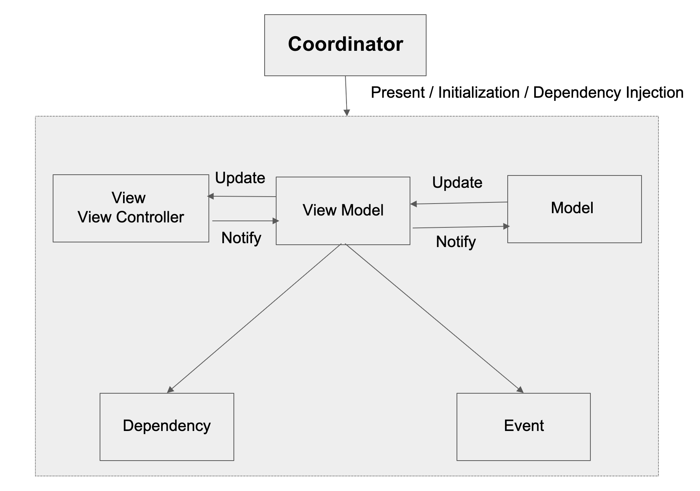

# Engine

 


### Extended MVVM architecture framework in Swift


## What's Engine 

In present days when we start building any kind of data driven or large scale applications, the first thing we do is choose a decent architecture for development. Some commonly used architecture patterns are MVC, MVP, MVI, MVVM and VIPER. Among those considering the ease of development and usabilty alongside with testabilty MVVM should be the first choice. But when working with MVVM many of us faced diffuclties with maintaing consistency. As a solution `Engine` is here to make your development with MVVM more consistent, effecient and time saving.


#### `E -> Entity -> Model`
#### `N -> Navigation -> Coordinator`
#### `G -> Graphics -> View`
#### `I -> Interactor -> ViewModel`
#### `N -> Narrator -> Dependency`
#### `E -> Events -> States & Actions`


## Theory Of Engine

 
 
In classic MVVM  we have Model, View & ViewModel. Now ViewModel is the place where we write all our UI indipendent logic based codes. But for a massive or complex feature a single ViewModel can get very messed up with different kinds of logic & dependency in one place. Also in classic MVVM the applications navigation flow is not managed.


As a solution first we are introducing the Coordinator for all our navigation and presentation releated tasks.



For offloading the ViewModel we are adding a Dependency element where we will put all our services (API/Storage etc) and outside dependent logics.

We are also adding some events property for generalizing our interaction and user experience flow.


Finally for the communication between different elements (Ex. View -> ViewModel / ViewModel -> View) , we are using the Reactive approach with data binding.

## Scaffolding


The Best thing about `Engine` is the code templating tool or in one word Scaffolding. We have some predefine feature & view based template for your quick development process. All you have to do is download & run the "install-xcode-template" file and then from your project try adding a new file.


## Installation

### CocoaPods

You can use [CocoaPods](http://cocoapods.org/) to install `Engine` by adding it to your `Podfile`:

```ruby
platform :ios, '8.0'
use_frameworks!

target 'MyApp' do
    pod 'Engine'
end
```

### Manually

To use this library in your project manually you may:  

1. for Projects, just drag all the (.swift) files from (Source\Engine) to the project tree
2. for Workspaces, include the whole Engine.xcodeproj

For installing `Engine` in your project we recommend the manual process by which you can get the full controll for customizing ENGINE elements based on your preferences.

## License

This project is licensed under the terms of the MIT license. See the LICENSE file for details.
